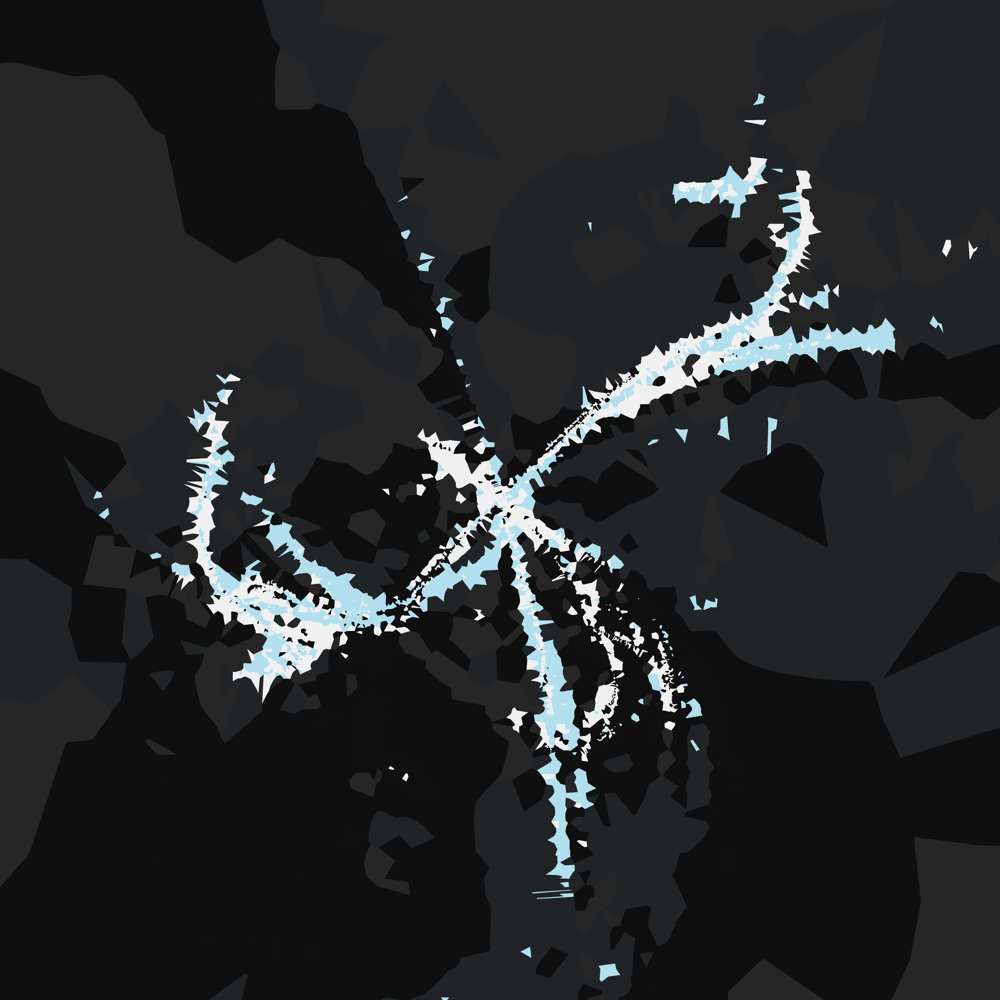

<!-- README.md is generated from README.Rmd. Please edit that file -->

```{r, include = FALSE}
knitr::opts_chunk$set(
  collapse = TRUE,
  comment = "#>",
  fig.path = "man/figures/README-",
  out.width = "100%"
)
```

# thorn03

<!-- badges: start -->
<!-- badges: end -->

The goal of thorn03 is to make pretty pictures


```{r example, eval=FALSE}
thorn03::thorn03("#101010")
```
```{r echo=FALSE}

```
